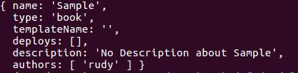
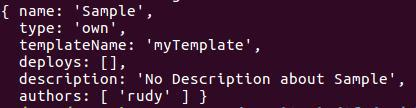
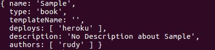
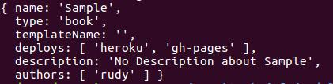
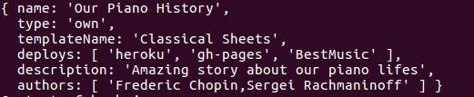
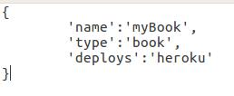
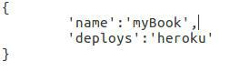

# __README STILL IN WRITING PROCESS__

## Welcome to the gitbook-setup package

[](https://coveralls.io/github/Cicko/gitbook-setup?branch=master)
[](https://travis-ci.org/Cicko/gitbook-setup)
[](https://www.npmjs.com/package/gitbook-setup)
[](https://www.npmjs.com/package/gitbook-setup)
[](https://www.npmjs.com/package/gitbook-setup)

If you've found this module to be useful and wish to support it, you may do so by visiting this pledgie campaign:
<a href='https://pledgie.com/campaigns/34797'></a>


### Motivation

The main purpose for *gitbook-setup* is to allow creation of documents with custom design and structure and deployment of them to a different platforms or servers easily. Imagine to build a whole website with markdown syntax! It's possible with *gitbook-setup* because gitbook allows creation of themes and them define the design and structure of the document.

```Markdown

# NAV

- Home
- About
- Blog
- Contact


# Home

There is the home page content


# About

There is the about page content

[Button link="http://www.google.com"] This is a button that opens Google [/Button]


```
The example above is a Markdown example document that can be used to build a website and is totally independent from the design and structure. Basically the idea is to provide an easy method to build things and Markdown is one of the most easy one because it's language is very similar with the human's one.


### Global installation

```
$ npm install -g gitbook-setup
```


```
$ gitbook-setup [help]
```


## Local installation

```
$ npm install --save gitbook-setup
```

## Usage

#### Doc creation

```js
var gitbook_setup = require('gitbook-setup')

var info = {
  name: "title",
  deploys: "heroku"
}

gitbook_setup.create(info, (err, allInfo) => {
  if (err) console.log(err)
  else {
    console.log("Book summary: ")
    console.log(allInfo)
  }
})
```

Optionally info can have a path variable to create the document at that path:

```js
var gitbook_setup = require('gitbook-setup')

var info = {
  name: "title",
  deploys: "heroku",
  path: "/home/rudy/Desktop/Docs/"
}

gitbook_setup.create(info, (err, allInfo) => {
  if (err) console.log(err)
  else {
    console.log("Book summary: ")
    console.log(allInfo)
  }
})
```

#### Doc installation


## Dependencies
| Name         | Version                          |
|--------------|----------------------------------|
| Nodejs           | >= 8.x.x                        |
| NPM           | >= 3.x.x                        |

## Possible commands
- Create
- Install
- Deploy


## Book creation

You have now three options for creating a book:
 - Passing book configuration through arguments.
 - Giving a file with the whole configuration.
 - In interactive form. The program will ask you for all information.

 The creation of a book by interactive form is the most user-friendly. The argument form of creation is useful when you want to create a lot of books for example and fast for students. The file method of creation could be useful when you want to send through the network the book information to create it in other place for example I could send a file configuration to China and there they can create the book.


 To create a book you have to execute

 ```bash
 > gitbook-setup create [interactive (default) | args | file -f <filename> ]
 ```

### By Arguments
If you want to create a book by arguments you have these fields:
- -n bookname (required)
- -t book (default) | api | faq | own:moduleName  
- -d heroku | gh-pages | moduleName
- -a author/s
- -i description

__Example 1 - Simplest book__

```bash
> gitbook-setup create args -n Sample
```
Will output:


__Example 2 - Simplest book with my own template__

```bash
> gitbook-setup create args -n Sample -t own:myTemplate
```
Will output:



__Example 3 - Book deployed to Heroku__

```bash
> gitbook-setup create args -n Sample -d heroku
```
Will output:


__Example 4 - Book deployed to Heroku and gh-pages__

```bash
> gitbook-setup create args -n Sample -d heroku,gh-pages
```
Will output:


__Example 5 - Book titled 'Our Piano History' with the template 'Classical Sheets', deployed to heroku, gh-pages and my server 'BestMusic', written by Frederic Chopin and Sergei Rachmaninoff and with some description about the book__

```bash
> gitbook-setup create args -n 'Our Piano History' -t own:'Classical Sheets' -d heroku,gh-pages,BestMusic -a 'Frederic Chopin','Sergei Rachmaninoff' -i 'Amazing story about our piano lifes'
```
Will output:



### By file

If you saw the output of the previous examples you have to create a file with the identical content. For example you want a book title myBook that allows deployment to heroku you have to create a file like that:



This file will create the same book:




Because by defaut the type is book.


The field name is a requirement. All other fields are optional.

### Interactive

The program will just ask you for all fields and you will fill them.
